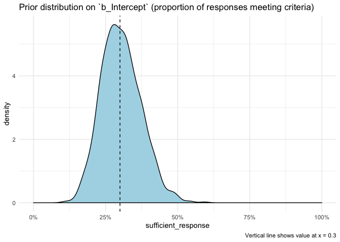
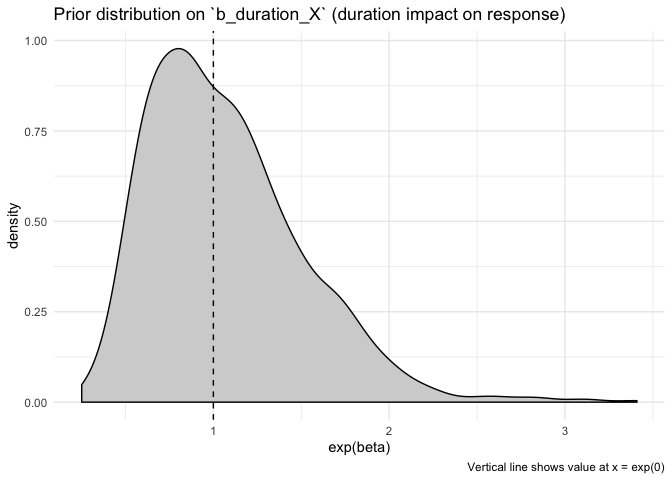
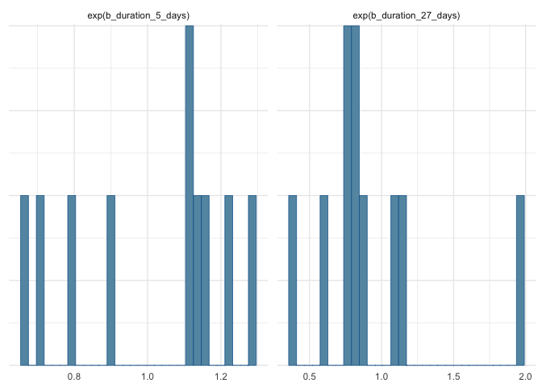
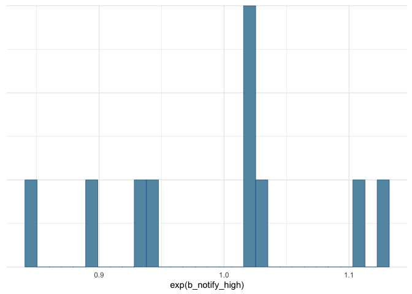
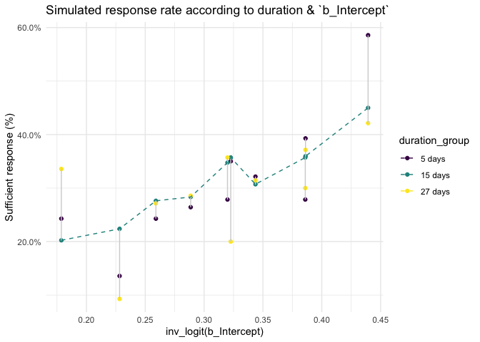
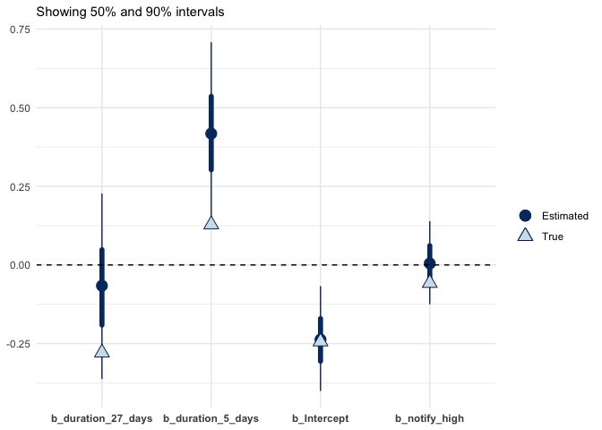

Prototype simtest without random effects
================
Jacqueline Buros
9/5/2019

The purpose of this document is to review the quality of data simulations & fits to simulated data. Though we will be reviewing fits to simulated data at a particular sample size, this will serve as a prototype of the process used to evaluate the quality of results at various sample sizes.

Review priors & model
---------------------

First we should review the priors used to simulate our data (& also used as priors to our model fit, by the way).

(Note that, for each `draw` in our simulation process, the priors are non-biased in the sense that the parameters for effects of interest are centered at 0, however each draw uses a **particular** value of that parameter drawn from the prior distribution to simulate data.)

We will see what this means as we go through the simulated data process.

### Prior on `b_Intercept`

The `Intercept` term defines the proportion of the population in the 15-day study length meeting the criteria for a "sufficient" response.

I have put a fairly narrow prior centered at the 30% mark or (after applying a logit transform) `logit(0.3)` (-0.85):

    ##                                    prior 
    ## "student_t(10, -0.847297860387204, 0.3)"

Here is what this distribution looks like when transformed back to the inv\_logit or original scale:

### Prior on `b_duration_X`

We originally started with what is a typical weakly informative prior (`normal(0, 1)`) on the `beta` effects describing the offset from the response at 15 days for the other two study durations of 5 & 27 days. However this led to much larger effect sizes than I would have expected (ie sufficient-response rates close to 80% in one group).

In this set of responses the prior on these betas is more narrow: normal(0, 0.4).

Let's see how that translates into a more familiar metric such as an OR.

This suggests even this distribution is too large for our betas -- I say this because there is significant density at a two-fold difference in response depending on the study duration (however -- maybe this is right?).

Nonetheless in this review we are only looking at 10 particular realizations from this distribution.

### Prior on `b_notify_high`

Finally we will review the priors on our notification level.

Here we start with a more narrow prior than for the duration since I expect this will be a weaker effect.

Our prior is: normal(0, 0.1).

Let's see how that translates into a more familiar metric such as an OR.

This is still centered at 0 (OR = 1) but with a more narrow distribution that we had used for the duration effect. Keep in mind that these are both starting points; we can improve upon them in future versions.

Nonetheless in this review we are only looking at 10 particular realizations from this distribution.

Simulated response data
-----------------------

Finally let's take a look at our simulated response data under these 10 scenarios.

Posterior fits
--------------

We can now review the posterior fits for each of these scenarios. First, let's do a "typical" or generic summary of the posterior vs the parameter values.

Next, we will write a function to summarise the metrics we "really" (supposedly) care about in our particular use case.

I would say these are (for each parameter):

1.  Width of posterior 90% CI (credible interval)
2.  Does the true value fall within the 90% posterior credible interval (check calibration)
3.  For regression parameters, estimate the Type S (sign) error rate \[if CI excludes 0\]

-   IE does this interval contain 0?
    -   if so, consider this analysis as "inconclusive"
    -   if *not*, call the beta as being &lt; or &gt; 0
-   compare this determination to the direction of the "true effect"

1.  For regression parameters, estimate the Type M (magnitude) error rate \[if CI excludes 0\]

-   IE does this interval contain 0?
    -   if so, consider this analysis as "inconclusive"
    -   if *not*, use the median value of the parameter as the "estimated effect"
-   compare this determination to the value of the "true effect". Is it &gt;2 times as large?

Let's prototype this summary for each of our model fit summarized above.

    ## # A tibble: 4 x 7
    ##   parname .width ci_width ci_contains_tru… ci_contains_0 ci_type_s_error
    ##   <chr>    <dbl>    <dbl> <lgl>            <lgl>                   <int>
    ## 1 b_dura…    0.9    0.587 TRUE             TRUE                       NA
    ## 2 b_dura…    0.9    0.573 FALSE            FALSE                       0
    ## 3 b_Inte…    0.9    0.330 TRUE             FALSE                       0
    ## 4 b_noti…    0.9    0.261 TRUE             TRUE                       NA
    ## # … with 1 more variable: ci_type_m_error <int>

This is how we will summarize the results for all 10 fits. We will additionally retain the "true value" in our result vector since we will eventually want to summarise how our fit quality changes for different magnitudes of effect.

    ## # A tibble: 4 x 6
    ##   parname ci_width ci_contains_tru… ci_contains_0 ci_type_s_error
    ##   <chr>      <dbl>            <dbl>         <dbl>           <dbl>
    ## 1 b_dura…    0.626              0.9           0.7               0
    ## 2 b_dura…    0.634              0.8           0.8               0
    ## 3 b_Inte…    0.356              1             0                 0
    ## 4 b_noti…    0.282              1             0.9               0
    ## # … with 1 more variable: ci_type_m_error <dbl>

These are the summary stats we will collect for each posterior fit over a range of sample sizes (& simulated "true values" of parameters).
