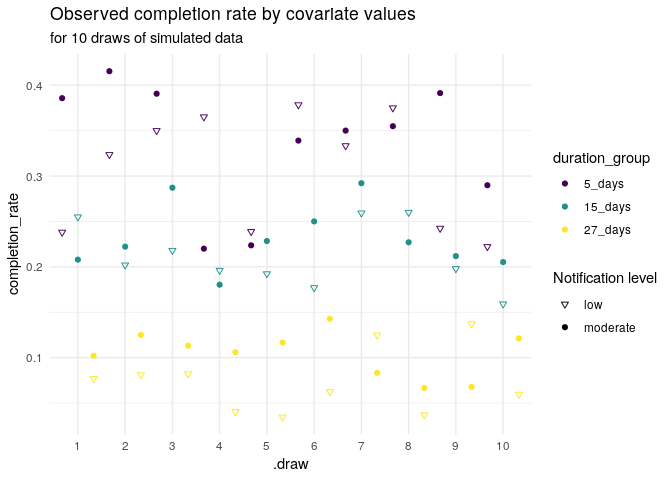
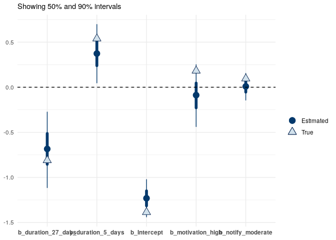

Prototype simtest with a motivation effect
================
Jacqueline Buros
9/6/2019

The purpose of this document is to review the quality of model fits to
simulated data. This document builds on an earlier doc by including a
“motivation” effect on the outcome (completion rate) in addition to
the effects of study duration & notification level.

## Review simulation parameters

First we should review the parameters used to simulate our data. In this
round of simulations, a fixed set of parameter values are used to
simulate data for all of our draws. We have parameters for the
completion rate according to duration consistent with 30%, 20%, and 10%
response in the 5-day, 15-day and 27-day groups respectively where
notification level is low.

Increasing the notification level to “moderate” confers a modest
increase in completion rate uniformly across these three groups. This is
reflected by a fixed OR of 1.1 (roughly a 10% increase).

In addition, we are assuming that the motivation level will be set into
two groups (mostly for simplicity of the simulation) high vs low, and
that roughly 20% of the participants will be in the “high” motivation
group. Motivation increases completion rate by an OR of 1.2.

Given these parameter values, these are the “target” completion rates
for each of our groups used to simulate our data.

<table>

<thead>

<tr>

<th style="text-align:left;">

duration\_group

</th>

<th style="text-align:left;">

notification\_level

</th>

<th style="text-align:left;">

not highly motivated (1-4)

</th>

<th style="text-align:left;">

highly motivated (5)

</th>

</tr>

</thead>

<tbody>

<tr>

<td style="text-align:left;">

5\_days

</td>

<td style="text-align:left;">

low

</td>

<td style="text-align:left;">

30.0%

</td>

<td style="text-align:left;">

34.0%

</td>

</tr>

<tr>

<td style="text-align:left;">

5\_days

</td>

<td style="text-align:left;">

moderate

</td>

<td style="text-align:left;">

32.0%

</td>

<td style="text-align:left;">

36.1%

</td>

</tr>

<tr>

<td style="text-align:left;">

15\_days

</td>

<td style="text-align:left;">

low

</td>

<td style="text-align:left;">

20.0%

</td>

<td style="text-align:left;">

23.1%

</td>

</tr>

<tr>

<td style="text-align:left;">

15\_days

</td>

<td style="text-align:left;">

moderate

</td>

<td style="text-align:left;">

21.6%

</td>

<td style="text-align:left;">

24.8%

</td>

</tr>

<tr>

<td style="text-align:left;">

27\_days

</td>

<td style="text-align:left;">

low

</td>

<td style="text-align:left;">

10.0%

</td>

<td style="text-align:left;">

11.8%

</td>

</tr>

<tr>

<td style="text-align:left;">

27\_days

</td>

<td style="text-align:left;">

moderate

</td>

<td style="text-align:left;">

10.9%

</td>

<td style="text-align:left;">

12.8%

</td>

</tr>

</tbody>

</table>

Of course, each draw of simulated data has a different *observed*
completion rate. There are two sources of variation contributing to the
observed completion rate in each draw. One is the composition of the
particular study population – both the notification rate and the
assignment to duration groups is randomized and so one would expect
*some* imbalance in these assignments in practice.

Looking at the group sizes over our draws can give a sense of how this
would be expected to vary in practice for a sample of this size (640
participants).

<table>

<thead>

<tr>

<th style="text-align:left;">

duration\_group

</th>

<th style="text-align:left;">

notification\_level

</th>

<th style="text-align:left;">

motivation\_level

</th>

<th style="text-align:right;">

1

</th>

<th style="text-align:right;">

2

</th>

<th style="text-align:right;">

3

</th>

<th style="text-align:right;">

4

</th>

<th style="text-align:right;">

5

</th>

</tr>

</thead>

<tbody>

<tr>

<td style="text-align:left;">

5\_days

</td>

<td style="text-align:left;">

low

</td>

<td style="text-align:left;">

not highly motivated (1-4)

</td>

<td style="text-align:right;">

49

</td>

<td style="text-align:right;">

51

</td>

<td style="text-align:right;">

50

</td>

<td style="text-align:right;">

50

</td>

<td style="text-align:right;">

52

</td>

</tr>

<tr>

<td style="text-align:left;">

5\_days

</td>

<td style="text-align:left;">

low

</td>

<td style="text-align:left;">

highly motivated (5)

</td>

<td style="text-align:right;">

14

</td>

<td style="text-align:right;">

17

</td>

<td style="text-align:right;">

10

</td>

<td style="text-align:right;">

13

</td>

<td style="text-align:right;">

15

</td>

</tr>

<tr>

<td style="text-align:left;">

5\_days

</td>

<td style="text-align:left;">

moderate

</td>

<td style="text-align:left;">

not highly motivated (1-4)

</td>

<td style="text-align:right;">

54

</td>

<td style="text-align:right;">

53

</td>

<td style="text-align:right;">

52

</td>

<td style="text-align:right;">

40

</td>

<td style="text-align:right;">

62

</td>

</tr>

<tr>

<td style="text-align:left;">

5\_days

</td>

<td style="text-align:left;">

moderate

</td>

<td style="text-align:left;">

highly motivated (5)

</td>

<td style="text-align:right;">

16

</td>

<td style="text-align:right;">

12

</td>

<td style="text-align:right;">

12

</td>

<td style="text-align:right;">

10

</td>

<td style="text-align:right;">

14

</td>

</tr>

<tr>

<td style="text-align:left;">

15\_days

</td>

<td style="text-align:left;">

low

</td>

<td style="text-align:left;">

not highly motivated (1-4)

</td>

<td style="text-align:right;">

160

</td>

<td style="text-align:right;">

164

</td>

<td style="text-align:right;">

149

</td>

<td style="text-align:right;">

163

</td>

<td style="text-align:right;">

143

</td>

</tr>

<tr>

<td style="text-align:left;">

15\_days

</td>

<td style="text-align:left;">

low

</td>

<td style="text-align:left;">

highly motivated (5)

</td>

<td style="text-align:right;">

44

</td>

<td style="text-align:right;">

34

</td>

<td style="text-align:right;">

39

</td>

<td style="text-align:right;">

41

</td>

<td style="text-align:right;">

39

</td>

</tr>

<tr>

<td style="text-align:left;">

15\_days

</td>

<td style="text-align:left;">

moderate

</td>

<td style="text-align:left;">

not highly motivated (1-4)

</td>

<td style="text-align:right;">

167

</td>

<td style="text-align:right;">

132

</td>

<td style="text-align:right;">

173

</td>

<td style="text-align:right;">

149

</td>

<td style="text-align:right;">

155

</td>

</tr>

<tr>

<td style="text-align:left;">

15\_days

</td>

<td style="text-align:left;">

moderate

</td>

<td style="text-align:left;">

highly motivated (5)

</td>

<td style="text-align:right;">

35

</td>

<td style="text-align:right;">

39

</td>

<td style="text-align:right;">

29

</td>

<td style="text-align:right;">

34

</td>

<td style="text-align:right;">

42

</td>

</tr>

<tr>

<td style="text-align:left;">

27\_days

</td>

<td style="text-align:left;">

low

</td>

<td style="text-align:left;">

not highly motivated (1-4)

</td>

<td style="text-align:right;">

41

</td>

<td style="text-align:right;">

60

</td>

<td style="text-align:right;">

59

</td>

<td style="text-align:right;">

68

</td>

<td style="text-align:right;">

48

</td>

</tr>

<tr>

<td style="text-align:left;">

27\_days

</td>

<td style="text-align:left;">

low

</td>

<td style="text-align:left;">

highly motivated (5)

</td>

<td style="text-align:right;">

11

</td>

<td style="text-align:right;">

14

</td>

<td style="text-align:right;">

14

</td>

<td style="text-align:right;">

6

</td>

<td style="text-align:right;">

10

</td>

</tr>

<tr>

<td style="text-align:left;">

27\_days

</td>

<td style="text-align:left;">

moderate

</td>

<td style="text-align:left;">

not highly motivated (1-4)

</td>

<td style="text-align:right;">

43

</td>

<td style="text-align:right;">

51

</td>

<td style="text-align:right;">

41

</td>

<td style="text-align:right;">

51

</td>

<td style="text-align:right;">

52

</td>

</tr>

<tr>

<td style="text-align:left;">

27\_days

</td>

<td style="text-align:left;">

moderate

</td>

<td style="text-align:left;">

highly motivated (5)

</td>

<td style="text-align:right;">

6

</td>

<td style="text-align:right;">

13

</td>

<td style="text-align:right;">

12

</td>

<td style="text-align:right;">

15

</td>

<td style="text-align:right;">

8

</td>

</tr>

</tbody>

</table>

This is very likely a modest influence on the observed rates, but it is
nonetheless there.

The second source comes from the simulation of the outcome itself.

Here is a sample of the observed completion rates for each of our 6
covariate
combinations.

<!-- -->

## Review priors for the model fit

### Prior on `b_Intercept`

The `Intercept` term defines the proportion of the population in the
15-day study length completing the study. By study “completion”, we mean
that the participants met the minimum criteria for an evaluable
response.

I have put a fairly narrow prior centered at the 20%
mark:

<!-- -->

### Prior on `b_duration_X`

We originally started with what is a typical weakly informative prior
(`normal(0, 1)`) on the `beta` effects describing the offset from the
response at 15 days for the other two study durations of 5 & 27 days.
However this led to much larger effect sizes than I would have expected
(ie completion rates close to 80% in one group).

In this set of responses the prior on these betas is more narrow:
normal(0, 0.4).

Let’s see how that translates into a more familiar metric such as an
OR.

<!-- -->

This suggests even this distribution is too large for our betas – I say
this because there is significant density at a two-fold difference in
response depending on the study duration (however – maybe this is
right?).

### Prior on `b_notify_moderate`

Finally we will review the priors on our notification level.

Here we start with a more narrow prior than for the duration since I
expect this will be a weaker effect.

Our prior is: normal(0, 0.1).

Let’s see how that translates into a more familiar metric such as an
OR.

<!-- -->

This is still centered at 0 (OR = 1) but with a more narrow distribution
that we had used for the duration effect. Keep in mind that these are
both starting points; we can improve upon them in future versions.

## Posterior fits

We can now review the posterior fits for each of these scenarios. First,
let’s do a “typical” or generic summary of the posterior vs the
parameter
values.

<!-- -->

Next, we will write a function to summarise the metrics we “really”
(supposedly) care about in our particular use case.

I would say these are (for each parameter, and for a given credible
interval):

1.  Width of posterior 90% CI (credible interval)
2.  Does the true value fall within the 90% posterior credible interval
    (check calibration)
3.  For regression parameters, estimate the Type S (sign) error rate
    \[if CI excludes 0\]
      - IE does this interval contain 0?
          - if so, consider this analysis as “inconclusive”
          - if *not*, call the beta as being \< or \> 0
      - compare this determination to the direction of the “true effect”
4.  For regression parameters, estimate the Type M (magnitude) error
    rate \[if CI excludes 0\]
      - IE does this interval contain 0?
          - if so, consider this analysis as “inconclusive”
          - if *not*, use the median value of the parameter as the
            “estimated effect”
      - compare this determination to the value of the “true effect”. Is
        it \>2 times as large?

### Summary of model fits

Summarizing these metrics for our 100 fits at this sample size (n =
640):

<table>

<thead>

<tr>

<th style="text-align:left;">

parname

</th>

<th style="text-align:right;">

width

</th>

<th style="text-align:right;">

ci\_width

</th>

<th style="text-align:left;">

ci\_contains\_true\_value

</th>

<th style="text-align:left;">

ci\_contains\_0

</th>

<th style="text-align:left;">

ci\_type\_s\_error

</th>

<th style="text-align:left;">

ci\_type\_m\_error

</th>

</tr>

</thead>

<tbody>

<tr>

<td style="text-align:left;">

b\_duration\_27\_days

</td>

<td style="text-align:right;">

0.95

</td>

<td style="text-align:right;">

0.9189272

</td>

<td style="text-align:left;">

90.0%

</td>

<td style="text-align:left;">

17.0%

</td>

<td style="text-align:left;">

0.0%

</td>

<td style="text-align:left;">

0.0%

</td>

</tr>

<tr>

<td style="text-align:left;">

b\_duration\_5\_days

</td>

<td style="text-align:right;">

0.95

</td>

<td style="text-align:right;">

0.7849221

</td>

<td style="text-align:left;">

94.0%

</td>

<td style="text-align:left;">

37.0%

</td>

<td style="text-align:left;">

0.0%

</td>

<td style="text-align:left;">

0.0%

</td>

</tr>

<tr>

<td style="text-align:left;">

b\_Intercept

</td>

<td style="text-align:right;">

0.95

</td>

<td style="text-align:right;">

0.5035278

</td>

<td style="text-align:left;">

94.0%

</td>

<td style="text-align:left;">

0.0%

</td>

<td style="text-align:left;">

0.0%

</td>

<td style="text-align:left;">

0.0%

</td>

</tr>

<tr>

<td style="text-align:left;">

b\_motivation\_high

</td>

<td style="text-align:right;">

0.95

</td>

<td style="text-align:right;">

0.8125166

</td>

<td style="text-align:left;">

95.0%

</td>

<td style="text-align:left;">

96.0%

</td>

<td style="text-align:left;">

25.0%

</td>

<td style="text-align:left;">

75.0%

</td>

</tr>

<tr>

<td style="text-align:left;">

b\_notify\_moderate

</td>

<td style="text-align:right;">

0.95

</td>

<td style="text-align:right;">

0.3482306

</td>

<td style="text-align:left;">

100.0%

</td>

<td style="text-align:left;">

100.0%

</td>

<td style="text-align:left;">

NaN%

</td>

<td style="text-align:left;">

NaN%

</td>

</tr>

</tbody>

</table>

The width of the credible intervals shown above, however, is on the
log(OR) scale. It’s not very easy to tell what that might look like in
practice.

Let’s review what the posterior density for the OR looks like in order
to better appreciate
this.

<!-- -->
